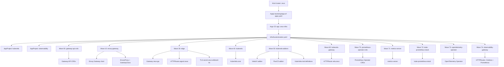

# kind-argocd-vela

This repo bootstraps a local Kind cluster (`zeus`) and then lets Argo CD manage the platform stack, including KubeVela and its addons.

## Architecture Diagram



## What the Zeus cluster deploys

From `gitops/clusters/zeus/infra`, Argo CD applies resources in sync-wave order:

1. `0`  Gateway API CRDs (`app-00-gateway-api-crds.yaml`)
2. `10` Envoy Gateway + `GatewayClass` (`app-10-envoy-gateway.yaml`)
3. `30` Edge Gateway + Argo CD route + TLS secret generation (`app-30-edge.yaml`)
4. `40` KubeVela core (`app-40-kubevela.yaml`)
5. `50` KubeVela addons (VelaUX + FluxCD) (`app-50-kubevela-addons.yaml`)
6. `60` VelaUX route (`app-60-kubevela-gateway.yaml`)
7. `70` Prometheus Operator CRDs (`app-70-prometheus-operator-crds.yaml`)
8. `71` Metrics Server (`app-71-metrics-server.yaml`)
9. `72` kube-prometheus-stack (`app-72-kube-prometheus-stack.yaml`)
10. `73` OpenTelemetry Operator (`app-73-opentelemetry-operator.yaml`)
11. `74` Observability gateway routes (`app-74-observability-gateway.yaml`)

## Prerequisites

- Docker
- `kind`
- `kubectl`
- `helm`
- Optional: `task` (Taskfile runner)

## Required setup steps

### Option A: Use Taskfile (recommended)

```bash
task bootstrap
```

`task bootstrap` runs the required flow in order:

1. `task create-cluster`
2. `task deploy-argocd`
3. `task deploy-app-of-apps`
4. `task wait-core`
5. `task get-argocd-password`

### Option B: Run commands manually

1. Create Kind cluster:

```bash
kind create cluster --config=gitops/clusters/zeus/kind-config.yaml --name zeus
```

2. Install Argo CD (imperative bootstrap only):

```bash
helm repo add argo https://argoproj.github.io/argo-helm
helm repo update

helm upgrade --install argocd argo/argo-cd \
  --namespace argocd \
  --create-namespace \
  --set server.insecure=true \
  --set configs.params.server\\.insecure=true \
  --set server.ingress.enabled=false \
  --set server.service.type=ClusterIP \
  --set notifications.enabled=false \
  --set dex.enabled=false
```

3. Apply app-of-apps bootstrap:

```bash
kubectl apply -f gitops/clusters/zeus/bootstrap/app-of-apps.yaml
```

4. Wait for core components:

```bash
kubectl -n argocd wait deployment/argocd-server --for=condition=Available --timeout=300s
kubectl -n vela-system wait deployment/vela-core --for=condition=Available --timeout=600s
kubectl -n monitoring wait deployment/prometheus-grafana --for=condition=Available --timeout=600s
kubectl -n observability wait deployment/opentelemetry-operator-controller-manager --for=condition=Available --timeout=600s
```

5. Retrieve Argo CD admin password:

```bash
kubectl -n argocd get secret argocd-initial-admin-secret -o jsonpath='{.data.password}' | base64 --decode; echo
```

## Access notes

- Kind maps host ports `80`/`443` to Envoy NodePorts in `gitops/clusters/zeus/kind-config.yaml`.
- Gateway hostnames are configured for `*.zeus`.
- Routes in this repo include:
  - `argocd.zeus` (`gitops/clusters/zeus/infra/30-edge/httproute-argocd.yaml`)
  - `vela.zeus` (`gitops/clusters/zeus/infra/60-kubevela-gateway/httproute-velaux.yaml`)

## Useful tasks

```bash
task check-dependencies
task create-cluster
task deploy-argocd
task deploy-app-of-apps
task wait-core
task get-argocd-password
task clean
```
