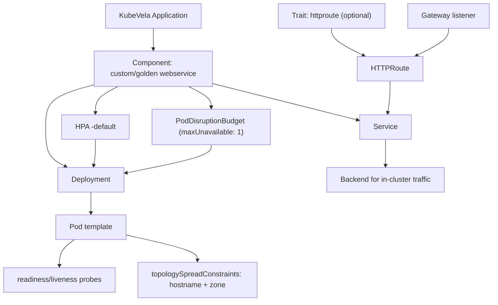

# Custom Webservice Definition

This document explains the features and usage of the KubeVela custom definition in `custom-webservice.yaml`, plus the custom `httproute` trait.

## Deployment characteristics provided by the custom definition

The custom webservice definition provides a full deployment baseline for web workloads.

### Resource graph



### Workload and service shape

- Creates a `Deployment` named after the component (`context.name`)
- Creates a `Service` named after the component (`context.name`)
- Uses component label `app.oam.dev/component: <component-name>` for selectors and matching
- Exposes one named HTTP port (`http`) mapped to the component `port` value

### Container runtime defaults

- Required image input:
  - `image`
- Default container port:
  - `port: 8080`
- Default health probes:
  - readiness probe HTTP GET on `probePath` (default `/healthz`) and `port`
  - liveness probe HTTP GET on `probePath` (default `/healthz`) and `port`
  - readiness timings: `initialDelaySeconds: 5`, `periodSeconds: 10`, `failureThreshold: 3`
  - liveness timings: `initialDelaySeconds: 10`, `periodSeconds: 10`, `failureThreshold: 3`
- Default resources:
  - `requests.cpu: 10m`
  - `requests.memory: 80Mi`
  - `limits.memory: 128Mi`
- Optional `envFrom`:
  - from `configMapName` if supplied

### Scheduling and resiliency defaults

- Topology spread constraints:
  - `kubernetes.io/hostname` with `maxSkew: 1`, `whenUnsatisfiable: DoNotSchedule`
  - `topology.kubernetes.io/zone` with `maxSkew: 1`, `whenUnsatisfiable: DoNotSchedule`
- Autoscaling behavior:
  - default HPA target: deployment `<component-name>`
  - `minReplicas: 2`
  - `maxReplicas: 10`
  - CPU utilization target: `70%`
  - deterministic HPA name: `<component-name>-default`
  - HPA can be disabled for custom autoscaling policies
- Pod disruption policy:
  - PodDisruptionBudget with `maxUnavailable: 1`

### Required application properties

At minimum, an app using this custom webservice definition should provide:

- `image` (required)

### Optional properties that users can override

- `port`
- `probePath`
- `labels`
- `resources`
- `configMapName`

Autoscaling/topology/PDB tunables should be overridden using the fields exposed by your merged `custom-webservice` schema.

## Application requirements

To use this custom definition successfully, the cluster/app environment must meet these requirements:

- KubeVela is installed and running (`vela-system` namespace).
- The custom component definition is installed in the cluster (for example `golden-webservice` / your `custom-webservice` definition).
- If you keep default probes, your app container must expose HTTP on `port` (default `8080`) and serve `GET /healthz` (or override `probePath`).
- If using `httproute` trait, Gateway API CRDs must be installed.
- If using `httproute` trait, a target `Gateway` and listener section must exist and allow your host/path.
- If using autoscaling traits (like `default-hpa`), Metrics Server must be installed.

## Override examples

### Minimal (only required field)

```yaml
apiVersion: core.oam.dev/v1beta1
kind: Application
metadata:
  name: demo-minimal
spec:
  components:
    - name: frontend
      type: golden-webservice
      properties:
        image: ghcr.io/acme/frontend:2026.02.14-1
```

### Override port, probe path, and resources

```yaml
apiVersion: core.oam.dev/v1beta1
kind: Application
metadata:
  name: demo-overrides
spec:
  components:
    - name: frontend
      type: golden-webservice
      properties:
        image: ghcr.io/acme/frontend:2026.02.14-1
        port: 9090
        probePath: /ready
        resources:
          requests:
            cpu: 100m
            memory: 128Mi
          limits:
            memory: 256Mi
```

### Override with additional labels and config map

```yaml
apiVersion: core.oam.dev/v1beta1
kind: Application
metadata:
  name: demo-config
spec:
  components:
    - name: frontend
      type: golden-webservice
      properties:
        image: ghcr.io/acme/frontend:2026.02.14-1
        labels:
          team: platform
          tier: web
        configMapName: frontend-config
```

## `httproute` custom trait

This repo includes a custom trait definition at `gitops/clusters/zeus/infra/50-kubevela-addons/policies/traits/trait-httproute.yaml`.

### Trait defaults

- `routeName`: `<component-name>-route`
- `path`: `/`
- `gateway.name`: `zeus-gw`
- `gateway.namespace`: `envoy-gateway-system`
- `gateway.sectionName`: `https`
- `service.name`: `<component-name>`
- `service.port`: `8080`

### Required trait property

- `hostname`

### Optional trait overrides

- `routeName`
- `path`
- `gateway.name`
- `gateway.namespace`
- `gateway.sectionName`
- `service.name`
- `service.port`

### Trait usage example (default gateway, custom hostname)

```yaml
traits:
  - type: httproute
    properties:
      hostname: frontend.zeus
```

### Trait usage example (override gateway/path/service)

```yaml
traits:
  - type: httproute
    properties:
      routeName: frontend-public
      hostname: app.example.com
      path: /api
      gateway:
        name: public-gateway
        namespace: envoy-gateway-system
        sectionName: https
      service:
        name: frontend
        port: 9090
```

## Complete sample app using the custom webservice + `httproute`

```yaml
apiVersion: core.oam.dev/v1beta1
kind: Application
metadata:
  name: demo-custom-webservice
spec:
  components:
    - name: frontend
      type: golden-webservice
      properties:
        image: ghcr.io/acme/frontend:2026.02.14-1
        port: 8080
      traits:
        - type: httproute
          properties:
            hostname: frontend.zeus
```

## Notes

- The sample component type name above is `golden-webservice`, because that is the current custom webservice definition used in this repo's KubeVela customization docs.
- If your installed component definition name is `custom-webservice`, replace `type: golden-webservice` with `type: custom-webservice` in examples.
