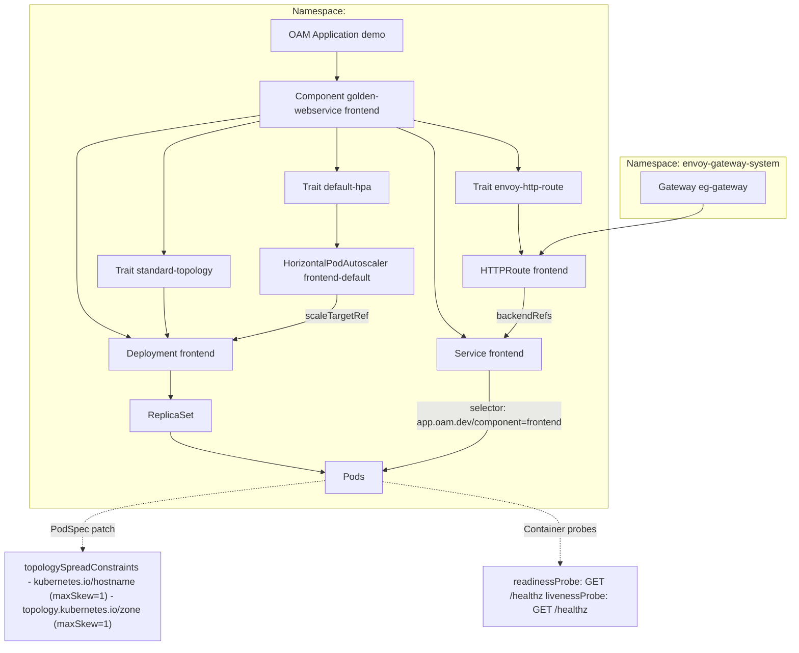

# Platform defaults to minimize required YAML to run a web service

This setup reduces the amount of **app YAML down to basically image + host**, while still letting teams override things when they need to.



## Define the following

1. **ComponentDefinition**: golden-webservice
   - Deployment + Service
   - default liveness/readiness = /healthz
   - default port/resources/etc.
1. **TraitDefinition**: standard-topology
   - injects two topology spread constraints:
     - kubernetes.io/hostname (node)
     - topology.kubernetes.io/zone (AZ)
     - maxSkew: 1
1. **TraitDefinition**: default-hpa
   - creates a standard HPA by default
   - can be disabled when an app supplies its own HPA (custom metrics)
1. **TraitDefinition**: envoy-http-route
   - creates a **Gateway API HTTPRoute** for Envoy Gateway

## Setup

## Golden webservice component (Deployment + Service + default probes)

```YAML
apiVersion: core.oam.dev/v1beta1
kind: ComponentDefinition
metadata:
  name: golden-webservice
  namespace: vela-system
spec:
  workload:
    definition:
      apiVersion: apps/v1
      kind: Deployment
  schematic:
    cue:
      template: |
        parameter: {
          image: string
          port: *8080 | int

          # Optional extra labels
          labels: *{} | [string]: string

          # Default probe path per your requirement
          probePath: *"/healthz" | string

          # Default resources (adjust to your org baseline)
          resources: *{
            requests: { cpu: "10m", memory: "80Mi" }
            limits:   { memory: "128Mi" }
          } | {...}

          # Optional envFrom configmap convention
          configMapName?: string
        }

        labels: {
          "app.oam.dev/component": context.name
        } & parameter.labels

        output: {
          apiVersion: "apps/v1"
          kind: "Deployment"
          metadata: {
            name: context.name
            labels: labels
          }
          spec: {
            selector: matchLabels: labels
            template: {
              metadata: labels: labels
              spec: {
                containers: [{
                  name: context.name
                  image: parameter.image
                  ports: [{ containerPort: parameter.port, name: "http" }]
                  resources: parameter.resources

                  readinessProbe: {
                    httpGet: { path: parameter.probePath, port: parameter.port }
                    initialDelaySeconds: 5
                    periodSeconds: 10
                    failureThreshold: 3
                  }

                  livenessProbe: {
                    httpGet: { path: parameter.probePath, port: parameter.port }
                    initialDelaySeconds: 10
                    periodSeconds: 10
                    failureThreshold: 3
                  }

                  if parameter.configMapName != _|_ {
                    envFrom: [{
                      configMapRef: { name: parameter.configMapName }
                    }]
                  }
                }]
              }
            }
          }
        }

        outputs: service: {
          apiVersion: "v1"
          kind: "Service"
          metadata: {
            name: context.name
            labels: labels
          }
          spec: {
            selector: labels
            ports: [{
              name: "http"
              port: parameter.port
              targetPort: parameter.port
            }]
          }
        }
```

## 2. Standard topology spread trait (node + zone, skew=1)

This patches the PodTemplate of the workload.

```YAML
apiVersion: core.oam.dev/v1beta1
kind: TraitDefinition
metadata:
  name: standard-topology
  namespace: vela-system
spec:
  appliesToWorkloads:
    - deployments.apps
  schematic:
    cue:
      template: |
        patch: {
          spec: template: spec: topologySpreadConstraints: [
            {
              maxSkew: 1
              topologyKey: "kubernetes.io/hostname"
              whenUnsatisfiable: "DoNotSchedule"
              labelSelector: matchLabels: {
                "app.oam.dev/component": context.name
              }
            },
            {
              maxSkew: 1
              topologyKey: "topology.kubernetes.io/zone"
              whenUnsatisfiable: "DoNotSchedule"
              labelSelector: matchLabels: {
                "app.oam.dev/component": context.name
              }
            },
          ]
        }
```

## 3. Default HPA trait (can be disabled so teams can bring custom metrics)

This gives you HPA “by default”, but if an app needs custom metrics they can either:

- set disable: true and supply their own HPA via another trait, or 
- use a separate “custom-hpa” trait you provide.

```YAML
apiVersion: core.oam.dev/v1beta1
kind: TraitDefinition
metadata:
  name: default-hpa
  namespace: vela-system
spec:
  appliesToWorkloads:
    - deployments.apps
  schematic:
    cue:
      template: |
        parameter: {
          disable: *false | bool
          minReplicas: *2 | int
          maxReplicas: *10 | int
          cpuUtilization: *70 | int
        }

        if parameter.disable == false {
          outputs: hpa: {
            apiVersion: "autoscaling/v2"
            kind: "HorizontalPodAutoscaler"
            metadata: {
              # keep deterministic; teams can disable + provide custom HPA with their own naming
              name: "\(context.name)-default"
              namespace: context.namespace
            }
            spec: {
              scaleTargetRef: {
                apiVersion: "apps/v1"
                kind: "Deployment"
                name: context.name
              }
              minReplicas: parameter.minReplicas
              maxReplicas: parameter.maxReplicas
              metrics: [{
                type: "Resource"
                resource: {
                  name: "cpu"
                  target: {
                    type: "Utilization"
                    averageUtilization: parameter.cpuUtilization
                  }
                }
              }]
            }
          }
        }
```

> Practical tip: When you use HPA, add an apply-once policy for the deployment’s spec.replicas so KubeVela doesn’t fight the HPA.

## 4. Envoy Gateway HTTPRoute trait

This creates a Gateway API HTTPRoute that points to the Service your component outputs.

```YAML
apiVersion: core.oam.dev/v1beta1
kind: TraitDefinition
metadata:
  name: envoy-http-route
  namespace: vela-system
spec:
  schematic:
    cue:
      template: |
        parameter: {
          host: string
          gatewayName: string
          gatewayNamespace: *"envoy-gateway-system" | string
          listenerSectionName: *"http" | string

          # defaults
          pathPrefix: *"/" | string
          port: *8080 | int
        }

        outputs: route: {
          apiVersion: "gateway.networking.k8s.io/v1"
          kind: "HTTPRoute"
          metadata: {
            name: context.name
            namespace: context.namespace
          }
          spec: {
            parentRefs: [{
              name: parameter.gatewayName
              namespace: parameter.gatewayNamespace
              sectionName: parameter.listenerSectionName
            }]
            hostnames: [parameter.host]
            rules: [{
              matches: [{
                path: {
                  type: "PathPrefix"
                  value: parameter.pathPrefix
                }
              }]
              backendRefs: [{
                name: context.name
                port: parameter.port
              }]
            }]
          }
        }
```

## What an app now looks like (very small)

```YAML
apiVersion: core.oam.dev/v1beta1
kind: Application
metadata:
  name: demo
spec:
  components:
    - name: frontend
      type: golden-webservice
      properties:
        image: ghcr.io/acme/frontend:2026.02.14-1
      traits:
        - type: standard-topology
        - type: default-hpa
        - type: envoy-http-route
          properties:
            host: frontend.example.com
            gatewayName: eg-gateway
```

## For custom metrics HPA

```YAML
traits:
  - type: default-hpa
    properties:
      disable: true
  - type: custom-hpa   # (your other trait that emits an HPA with custom metrics)
  ```
